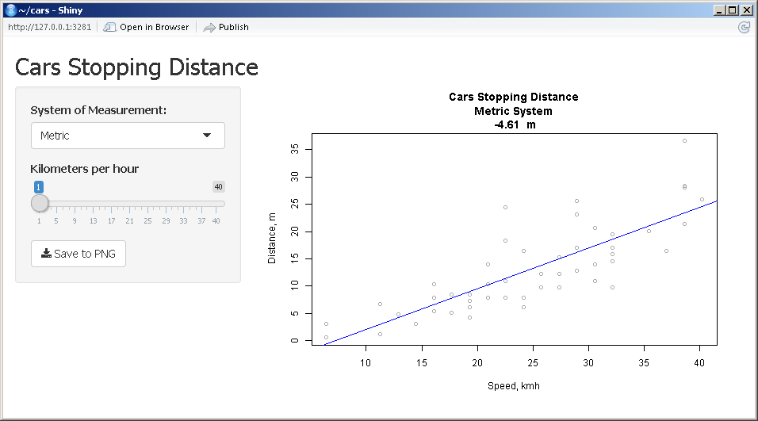

## Background

This is a simple presentation for Developing Data Products Project.

This presentation is another form of README file for project which is available by the following url: [http://DSCourse001.github.io/cars](http://DSCourse001.github.io/cars)

Application URL:
[https://dscourse001.shinyapps.io/cars](https://dscourse001.shinyapps.io/cars)

So, lets get started.

---

## Data

Data for that application has been obtained from the standard R data set

You can load it and view using following R commands.


```r
data(cars)
summary(cars)
```

```
##      speed           dist       
##  Min.   : 4.0   Min.   :  2.00  
##  1st Qu.:12.0   1st Qu.: 26.00  
##  Median :15.0   Median : 36.00  
##  Mean   :15.4   Mean   : 42.98  
##  3rd Qu.:19.0   3rd Qu.: 56.00  
##  Max.   :25.0   Max.   :120.00
```

---

## Analysis

This application does  exploratory analysis of two variables:
 * Stopping Distance
 * Speed

All of that variables can be views on a graph using Metric and Imperial Measurement Systems.

---

## After that

After you have performed exploratory analysis you can save a plot using corresponding button.



---


